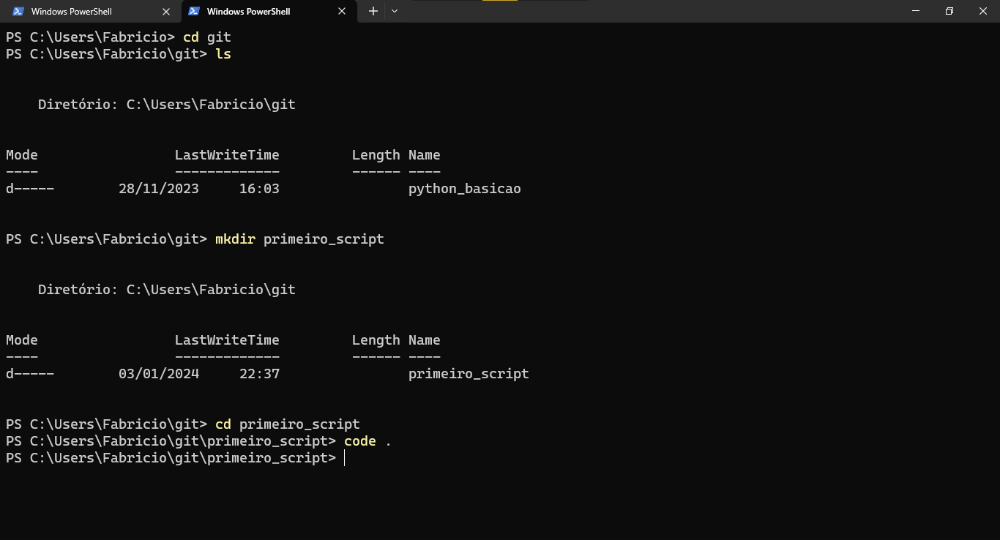
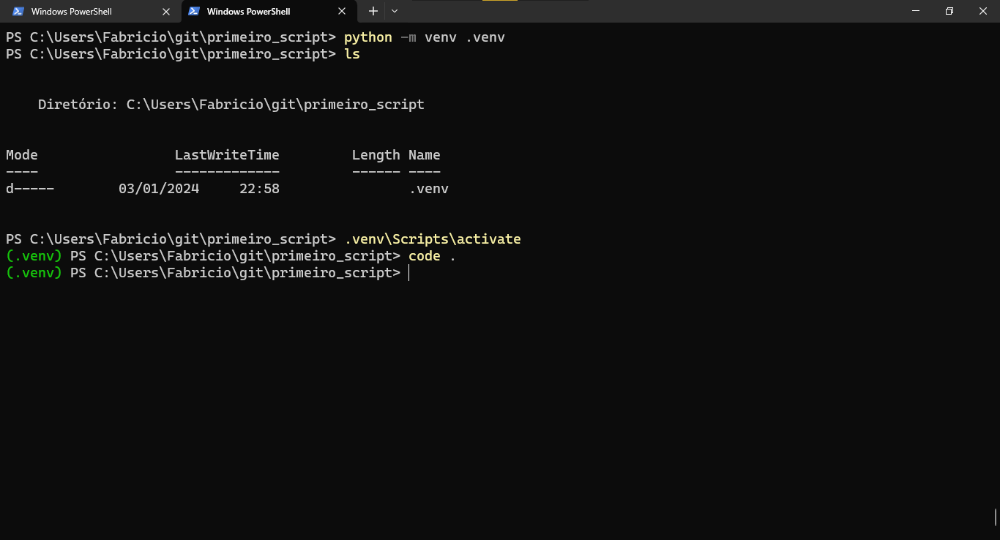
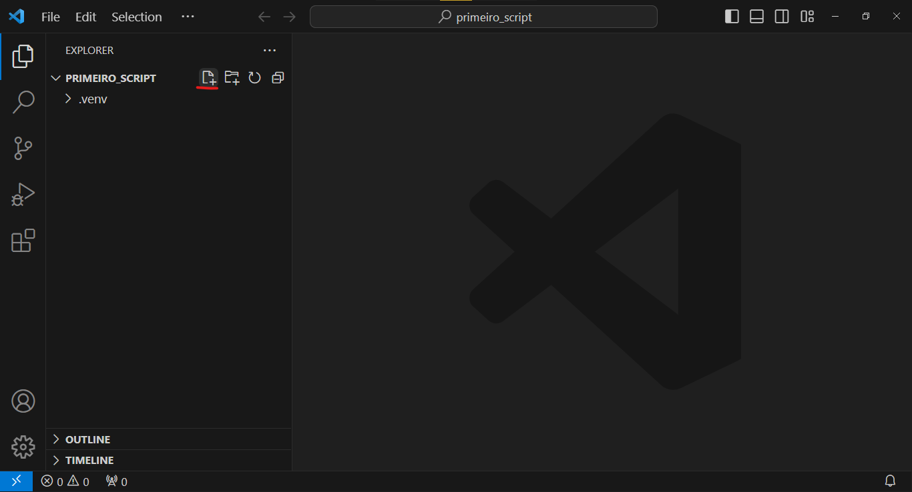
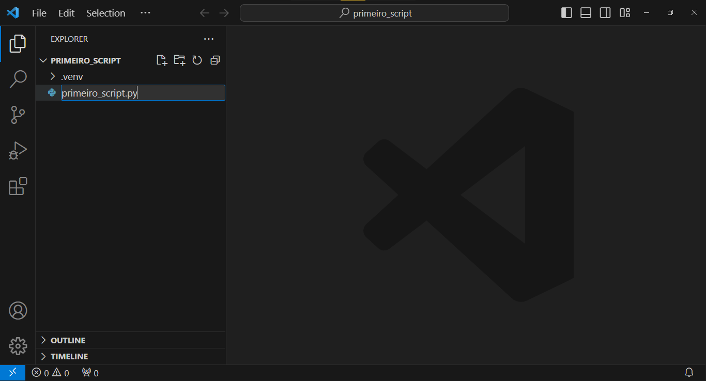
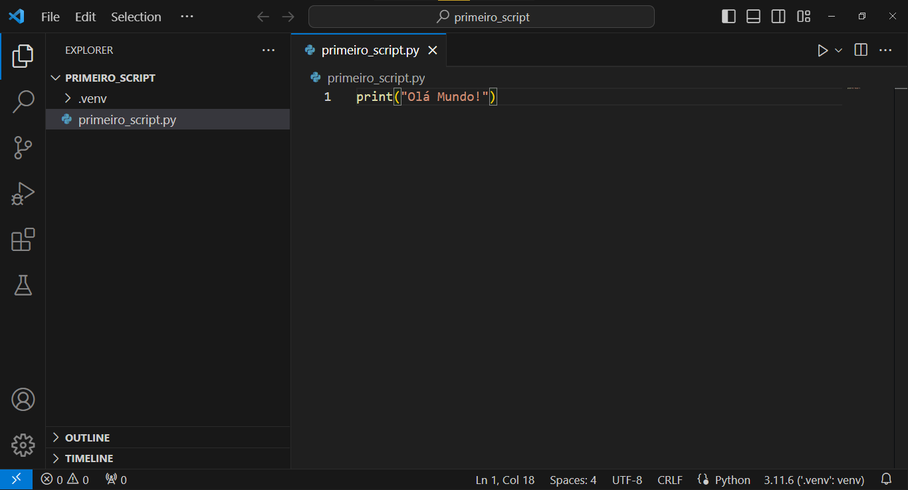
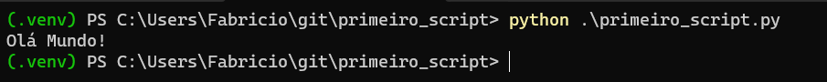
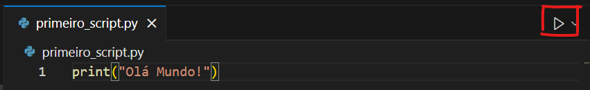

# Primeiro script Python

## Iniciar o VS Code em um diretorio de projeto

Muitos projeto começam com uma pasta vazia, e é como vamos iniciar.

Abra o seu Terminal, navegue até um diretorio de sua preferencia para iniciar seu projeto.

*Navegue até o diretorio de projetos*
```bash
> cd diretorio_de_projetos
```

*Crie um diretorio para seu primeiro script*
```bash
> mkdir primeiro_script
```

*Acessar o diretorio criado*
```bash
> cd primeiro_script
```

*Abrir o VS Code neste diretorio*
```bash
> code .
```

Abaixo, tem um exemplo seguindo os mesmos passos.



**Feito isso, vamos criar o ambiente virtual python.**

## Criando o Ambiente Virtual Python

> **Observação:** Vou continuar utilizando o terminal em separado do VS Code, mas fique a vontade de utilizar o terminal integrado do VS Code.
<br>

*Digite o seguinte comando*
```bash
> python -m venv .venv
```

> Este comando pode demorar um pouco para terminar sua execução, pois, ele basicamente copia sua instalação do python para sua pasta de projeto, aguarde o termino da execução.

<br>

| **Como funciona este comando** ||
|||
| **python** | chama o interpretador Python.|
| **-m** | É um parametro que diz ao interpretador que quer executar um modulo. |
| **venv** | É o modulo que será executado. |
| **.venv** | Nome do diretorio onde será instalado a copia do Python. |

*Verifique o diretorio criado*
```bash
> ls

Mode                 LastWriteTime         Length Name
----                 -------------         ------ ----
d-----        03/01/2024     22:58                .venv
```

*Ativar o ambiente virtual.*
```bash
> .venv\Scripts\activate

(.venv) ... \primeiro_script>
```

> Após ativar, será mostrado no prompt **(.venv)**, isso mostra que o ambiente virtual está ativo.

Logo após podemos abrir o VS Code neste diretorio, com comando ``code .`` como abaixo.



**Perfeito!** 

Temos o ambiente virtual criado e ativo, vsc aberto no diretorio, então vamos criar e rodar nosso primeiro script Python. :satisfied:

## Criando arquivo Python

*Já com o VS Code aberto na pasta criada, no painel Explorer, clique no icone de Novo Arquivo destacado.*


*Digite um nome para o arquivo com a extensão .py*


*Digite o comando ``print("Olá Mundo)`` no arquivo criado.


*Salve o arquivo com ``Ctrl + S``.*

## Executando o script

*Podemos executar o arquivo pelo terminal, como na imagem abaixo.


*Ou direto pelo VS Code, utilizando o botão 'Executar Arquivo Python', destacado.


*Maravilha! Executamos nosso primeiro script Python!*

**Vamos aprender mais um pouco de Python ?!**