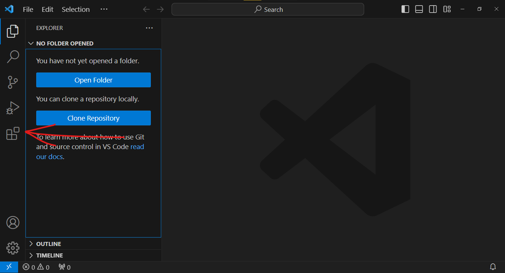

# Extensão do Python para Visual Studio Code

O Visual Studio Code é um editor de código avançado e um IDE ambiente de desenvolvimento integrado leve, de uso geral com uma ampla gama de extensões disponíveis para oferecer funcionalidade em diversas linguagens de programação. 
 
 
A extensão do Python para Visual Studio Code fornece indicações visuais, como codificação de cores e preenchimento automático, além de ferramentas de depuração para ajudá-lo a escrever um código Python melhor e mais rápido. 

Nesta seção vamos instalar a extensão do Python em seu editor VSCode.

## Instalar a extensão do Python

No Visual Studio Code, selecione <b>Exibir > Extensões</b> para abrir a exibição <i>Extensões</i>, ou clique no icone na barra lateral como indicado na imagem abaixo.

A parte de Extensões do Visual Studio Code lista as extensões instaladas e as extensões recomendadas mais populares no Marketplace.

Filtre a lista de extensões disponíveis digitando python na caixa de pesquisa na parte superior de Extensões.
 Selecione a extensão Python publicada pela Microsoft, descrita como IntelliSense (Pylance) e geralmente a primeira na lista.
Os detalhes sobre essa extensão aparecem em um painel com guias à direita.
 
 No painel Extensões ou no painel principal, selecione Instalar.

> **Observação:**
> No detalhe acima, a extensão já está instalada.

Quando a instalação for concluída, o botão Instalar será alterado para o ícone Configurações ⚙️ na exibição Extensões ou para dois botões, Desabilitar e Desinstalar no painel principal. Essa mensagem permite que você saiba que instalou com êxito a extensão do Python para Windows.

 
**Agora temos o mínimo para começar a codar em python. Pronto!?**